# 🔧 TECHNICAL SPECIFICATIONS
## FeelProd - Implementation Details

**Version:** 1.0  
**Date:** 29 janvier 2026  
**Phase:** M (Méthode)  
**Status:** Ready for Execution

---

## 1. VALIDATED DECISIONS

Suite à la revue PRD, voici les choix techniques confirmés :

| Décision | Choix Validé | Rationale |
|----------|--------------|-----------|
| **Supabase Schema** | Tables `projects` + `contact_submissions` | Extensible (future catégorie "Chatbots IA") |
| **Work Page Layout** | Grille Uniforme (Option B) | Cohérence avec design system existant |
| **Data Fetching** | Server Components (Option A) | SEO optimal, performance initiale |
| **Contact Success** | Checkmark SVG (Option B) | Minimaliste, aligné avec ADN blanc |

> [!NOTE]
> **Flexibilité Design** : Polices, espacements et médias seront affinés itérativement avec inspirations externes. L'implémentation doit rester modulaire.

---

## 2. SUPABASE SETUP - GUIDE COMPLET

### 2.1 Création du Projet

**Étape 1 : Initialisation Supabase**

1. Aller sur [supabase.com/dashboard](https://supabase.com/dashboard)
2. Créer un nouveau projet :
   - **Name** : `feelprod-production`
   - **Database Password** : Générer fort (sauvegarder dans 1Password/Bitwarden)
   - **Region** : Europe West (Frankfurt) - proximité France
   - **Pricing Plan** : Free tier suffisant pour MVP

3. Attendre ~2 min (provisioning)

**Étape 2 : Récupérer les Credentials**

Dans `Settings > API` :
```env
# Copier ces valeurs dans /feelprod-local/.env.local
NEXT_PUBLIC_SUPABASE_URL=https://xxxxx.supabase.co
NEXT_PUBLIC_SUPABASE_ANON_KEY=eyJhbGciOiJIUzI1NiIsInR5cCI6IkpXVCJ9...
```

---

### 2.2 Database Schema

**SQL à Exécuter** (Dashboard > SQL Editor)

```sql
-- ==================================================
-- FEELPROD DATABASE SCHEMA v1.0
-- ==================================================

-- Extension pour UUID auto-generation
CREATE EXTENSION IF NOT EXISTS "uuid-ossp";

-- ==================================================
-- TABLE: projects
-- Stocke les projets portfolio (vidéos/photos)
-- ==================================================
CREATE TABLE projects (
  id UUID PRIMARY KEY DEFAULT uuid_generate_v4(),
  created_at TIMESTAMPTZ NOT NULL DEFAULT NOW(),
  updated_at TIMESTAMPTZ NOT NULL DEFAULT NOW(),
  
  -- Contenu
  title TEXT NOT NULL,
  tagline TEXT,
  category TEXT NOT NULL CHECK (category IN ('souvenirs', 'adrenaline', 'evasion', 'chatbots-ia')),
  
  -- Média
  thumbnail_url TEXT NOT NULL,
  video_id TEXT,
  video_type TEXT DEFAULT 'youtube' CHECK (video_type IN ('youtube', 'local', 'vimeo')),
  
  -- Metadata
  color_accent TEXT DEFAULT '#FF9F1C', -- Couleur thème (hex)
  order_index INTEGER DEFAULT 0,
  is_published BOOLEAN DEFAULT TRUE,
  
  -- SEO (optionnel, pour futur)
  slug TEXT UNIQUE,
  description TEXT
);

-- Index pour performance
CREATE INDEX idx_projects_category ON projects(category);
CREATE INDEX idx_projects_published ON projects(is_published, order_index, created_at DESC);
CREATE INDEX idx_projects_slug ON projects(slug);

-- Trigger auto-update timestamp
CREATE OR REPLACE FUNCTION update_updated_at_column()
RETURNS TRIGGER AS $$
BEGIN
  NEW.updated_at = NOW();
  RETURN NEW;
END;
$$ LANGUAGE plpgsql;

CREATE TRIGGER update_projects_updated_at 
  BEFORE UPDATE ON projects 
  FOR EACH ROW 
  EXECUTE FUNCTION update_updated_at_column();

-- ==================================================
-- TABLE: contact_submissions
-- Stocke les soumissions formulaire Contact
-- ==================================================
CREATE TABLE contact_submissions (
  id UUID PRIMARY KEY DEFAULT uuid_generate_v4(),
  created_at TIMESTAMPTZ NOT NULL DEFAULT NOW(),
  
  -- Informations contact
  name TEXT NOT NULL,
  email TEXT NOT NULL,
  phone TEXT,
  
  -- Contenu
  project_type TEXT, -- souvenirs, adrenaline, evasion, chatbots-ia, autre
  message TEXT NOT NULL CHECK (LENGTH(message) >= 20),
  
  -- Workflow admin
  status TEXT DEFAULT 'new' CHECK (status IN ('new', 'read', 'replied', 'archived')),
  admin_notes TEXT,
  
  -- Metadata
  user_agent TEXT,
  ip_address INET
);

-- Index pour admin dashboard
CREATE INDEX idx_contact_status ON contact_submissions(status, created_at DESC);
CREATE INDEX idx_contact_email ON contact_submissions(email);

-- ==================================================
-- ROW LEVEL SECURITY (RLS)
-- ==================================================

-- Activer RLS sur les tables
ALTER TABLE projects ENABLE ROW LEVEL SECURITY;
ALTER TABLE contact_submissions ENABLE ROW LEVEL SECURITY;

-- PROJECTS : Lecture publique des projets publiés
CREATE POLICY "Public read published projects"
  ON projects
  FOR SELECT
  USING (is_published = TRUE);

-- PROJECTS : Admin full access (via service_role key ou auth future)
CREATE POLICY "Admin full access projects"
  ON projects
  FOR ALL
  USING (auth.role() = 'service_role');

-- CONTACT : Public peut uniquement INSERT
CREATE POLICY "Public can submit contact forms"
  ON contact_submissions
  FOR INSERT
  WITH CHECK (true);

-- CONTACT : Admin read/update (via dashboard)
CREATE POLICY "Admin read contact submissions"
  ON contact_submissions
  FOR SELECT
  USING (auth.role() = 'service_role');

CREATE POLICY "Admin update contact submissions"
  ON contact_submissions
  FOR UPDATE
  USING (auth.role() = 'service_role');

-- ==================================================
-- DONNÉES DE TEST
-- ==================================================

-- Projets exemple (à remplacer par vraies données)
INSERT INTO projects (title, tagline, category, thumbnail_url, video_id, video_type, color_accent, order_index) VALUES
  ('Mariage Emma & Lucas', 'Des moments inoubliables.', 'souvenirs', '/assets/images/1.jpg', 'Pfj2jnbRwfw', 'youtube', '#FF9F1C', 1),
  ('Baptême Chloé', 'Tendresse et émotions.', 'souvenirs', '/assets/images/2.jpg', 'Co8j8n_g_6Q', 'youtube', '#FF9F1C', 2),
  ('Compétition VTT 2025', 'L''action à l''état pur.', 'adrenaline', '/assets/images/6.jpg', 'CyRH585e4yY', 'youtube', '#F7E733', 3),
  ('Freeride Mont-Blanc', 'Descente extrême.', 'adrenaline', '/assets/images/7.jpg', 'CyRH585e4yY', 'youtube', '#F7E733', 4),
  ('Voyage Islande', 'Explorer de nouveaux horizons.', 'evasion', '/assets/images/11.jpg', 'WELgM9kD69A', 'youtube', '#4CC9F0', 5),
  ('Roadtrip Californie', 'Sur la route de la liberté.', 'evasion', '/assets/images/12.jpg', 'Iy4iQNKMJFQ', 'youtube', '#4CC9F0', 6);

-- Contact test (à supprimer après vérif)
INSERT INTO contact_submissions (name, email, project_type, message) VALUES
  ('Test User', 'test@example.com', 'souvenirs', 'Ceci est un message de test pour valider le formulaire.');

COMMIT;
```

---

### 2.3 Storage Configuration (Optionnel - Phase 2)

> [!TIP]
> Pour MVP, les médias restent dans `/public/assets/`. Migration vers Supabase Storage recommandée pour scalabilité.

**Si Upload Futur Nécessaire :**

1. Dashboard > Storage > Create Bucket
   - **Name** : `project-media`
   - **Public** : true (lecture publique)

2. Policies Storage :
```sql
-- Upload admin uniquement
CREATE POLICY "Admin upload media"
  ON storage.objects FOR INSERT
  WITH CHECK (bucket_id = 'project-media' AND auth.role() = 'service_role');

-- Lecture publique
CREATE POLICY "Public read media"
  ON storage.objects FOR SELECT
  USING (bucket_id = 'project-media');
```

---

### 2.4 Installation Client Next.js

**Commandes Terminal**

```bash
cd /Users/guillaumephilippe/feelprod-local

# Installer Supabase JS Client
npm install @supabase/supabase-js

# Créer fichier .env.local (si n'existe pas déjà)
touch .env.local
```

**Fichier `.env.local`** (ajouter ces lignes)

```env
# Supabase Configuration
NEXT_PUBLIC_SUPABASE_URL=https://xxxxx.supabase.co
NEXT_PUBLIC_SUPABASE_ANON_KEY=eyJhbGciOiJIUzI1NiIsInR5cCI6IkpXVCJ9...

# Optionnel : Service Role (JAMAIS côté client, API routes uniquement)
SUPABASE_SERVICE_ROLE_KEY=eyJhbGciOiJIUzI1NiIsInR5cCI6IkpXVCJ9...
```

> [!WARNING]
> **Sécurité** : `.env.local` doit être dans `.gitignore` (déjà configuré Next.js par défaut)

---

### 2.5 Création du Client Supabase

**Fichier : `src/lib/supabase.ts`** (à créer)

```typescript
import { createClient } from '@supabase/supabase-js'

// Type-safety pour la database
export type Database = {
  public: {
    Tables: {
      projects: {
        Row: {
          id: string
          created_at: string
          updated_at: string
          title: string
          tagline: string | null
          category: 'souvenirs' | 'adrenaline' | 'evasion' | 'chatbots-ia'
          thumbnail_url: string
          video_id: string | null
          video_type: 'youtube' | 'local' | 'vimeo'
          color_accent: string | null
          order_index: number
          is_published: boolean
          slug: string | null
          description: string | null
        }
        Insert: Omit<Database['public']['Tables']['projects']['Row'], 'id' | 'created_at' | 'updated_at'>
        Update: Partial<Database['public']['Tables']['projects']['Insert']>
      }
      contact_submissions: {
        Row: {
          id: string
          created_at: string
          name: string
          email: string
          phone: string | null
          project_type: string | null
          message: string
          status: 'new' | 'read' | 'replied' | 'archived'
          admin_notes: string | null
          user_agent: string | null
          ip_address: string | null
        }
        Insert: Omit<Database['public']['Tables']['contact_submissions']['Row'], 'id' | 'created_at'>
        Update: Partial<Database['public']['Tables']['contact_submissions']['Insert']>
      }
    }
  }
}

// Client Supabase (côté client ET serveur)
const supabaseUrl = process.env.NEXT_PUBLIC_SUPABASE_URL!
const supabaseAnonKey = process.env.NEXT_PUBLIC_SUPABASE_ANON_KEY!

if (!supabaseUrl || !supabaseAnonKey) {
  throw new Error('Missing Supabase environment variables. Check .env.local')
}

export const supabase = createClient<Database>(supabaseUrl, supabaseAnonKey)

// Helper pour Server Components (si auth future)
export const createServerClient = () => {
  return createClient<Database>(supabaseUrl, supabaseAnonKey)
}
```

---

### 2.6 Test de Connexion

**Fichier : `src/app/test-supabase/page.tsx`** (temporaire)

```typescript
import { supabase } from '@/lib/supabase'

export default async function TestSupabasePage() {
  // Fetch projects (Server Component)
  const { data: projects, error } = await supabase
    .from('projects')
    .select('*')
    .limit(5)

  if (error) {
    return (
      <div className="p-8">
        <h1 className="text-2xl font-bold text-red-500">Erreur Supabase</h1>
        <pre className="mt-4 bg-gray-100 p-4 rounded">{JSON.stringify(error, null, 2)}</pre>
      </div>
    )
  }

  return (
    <div className="p-8">
      <h1 className="text-2xl font-bold mb-4">✅ Supabase connecté</h1>
      <p className="mb-4">Projets récupérés : {projects?.length || 0}</p>
      <pre className="bg-gray-100 p-4 rounded overflow-auto">
        {JSON.stringify(projects, null, 2)}
      </pre>
    </div>
  )
}
```

**Validation :**
```bash
npm run dev
# Ouvrir http://localhost:3000/test-supabase
# Vérifier que les projets s'affichent
```

---

## 3. COMPONENT ARCHITECTURE

### 3.1 Structure de Fichiers (À Créer)

```
src/
├── lib/
│   └── supabase.ts              # ✅ Client Supabase + Types
├── app/
│   ├── work/
│   │   └── page.tsx             # 🔲 Page Portfolio
│   ├── contact/
│   │   └── page.tsx             # 🔲 Page Contact
│   └── api/                     # Optionnel Phase 2
│       └── contact/
│           └── route.ts         # API route sécurisée
├── components/
│   ├── ProjectGrid.tsx          # 🔲 Grille projets Work
│   ├── ProjectCard.tsx          # 🔲 Carte projet individuelle
│   ├── ContactForm.tsx          # 🔲 Formulaire Contact
│   ├── SuccessCheckmark.tsx     # 🔲 Animation checkmark
│   └── (existants)
│       ├── Reveal.tsx           # ✅ Déjà créé
│       ├── InfiniteCarousel.tsx # ✅ Déjà créé
│       └── VideoModal.tsx       # ✅ Déjà créé
```

---

### 3.2 Composant : ProjectGrid

**Fichier : `src/components/ProjectGrid.tsx`**

**Responsabilités :**
- Afficher grille de projets (responsive 1/2/3 colonnes)
- Gérer state modal vidéo
- Réutiliser classes `.card` du design system

**Props :**
```typescript
interface ProjectGridProps {
  projects: Database['public']['Tables']['projects']['Row'][]
  onProjectClick?: (project: Project) => void
}
```

**Layout CSS (Tailwind) :**
```tsx
<div className="grid grid-cols-1 md:grid-cols-2 lg:grid-cols-3 gap-5 px-[5%] pb-12">
  {projects.map(project => (
    <ProjectCard key={project.id} project={project} />
  ))}
</div>
```

---

### 3.3 Composant : ProjectCard

**Fichier : `src/components/ProjectCard.tsx`**

**Structure :**
```tsx
<motion.div
  className="card"
  whileHover={{ scale: 1.02 }}
  onClick={() => openModal(project.video_id)}
>
  <Image
    src={project.thumbnail_url}
    alt={project.title}
    fill
    className="object-cover"
  />
  
  {/* Overlay titre au hover */}
  <div className="overlay">
    <h3 className="service-logo" style={{ color: project.color_accent }}>
      {project.title}
    </h3>
    {project.tagline && (
      <p className="service-tagline">{project.tagline}</p>
    )}
  </div>
</motion.div>
```

**CSS Additionnel** (ajouter dans `globals.css`) :
```css
.card .overlay {
  position: absolute;
  inset: 0;
  background: rgba(255, 255, 255, 0.9);
  display: flex;
  flex-direction: column;
  justify-content: center;
  align-items: center;
  opacity: 0;
  transition: opacity 0.3s ease;
  padding: 20px;
}

.card:hover .overlay {
  opacity: 1;
}
```

---

### 3.4 Composant : ContactForm

**Fichier : `src/components/ContactForm.tsx`**

**States :**
```typescript
const [formData, setFormData] = useState({
  name: '',
  email: '',
  phone: '',
  project_type: '',
  message: ''
})
const [status, setStatus] = useState<'idle' | 'loading' | 'success' | 'error'>('idle')
const [errorMessage, setErrorMessage] = useState('')
```

**Validation :**
```typescript
const validateForm = () => {
  if (!formData.name.trim()) return 'Le nom est requis'
  if (!formData.email.match(/^[^\s@]+@[^\s@]+\.[^\s@]+$/)) return 'Email invalide'
  if (formData.message.length < 20) return 'Message trop court (min 20 caractères)'
  return null
}
```

**Submit Handler :**
```typescript
const handleSubmit = async (e: FormEvent) => {
  e.preventDefault()
  
  const validationError = validateForm()
  if (validationError) {
    setErrorMessage(validationError)
    return
  }
  
  setStatus('loading')
  
  const { error } = await supabase
    .from('contact_submissions')
    .insert([{
      name: formData.name,
      email: formData.email,
      phone: formData.phone || null,
      project_type: formData.project_type || null,
      message: formData.message,
      user_agent: navigator.userAgent
    }])
  
  if (error) {
    setStatus('error')
    setErrorMessage(error.message)
    return
  }
  
  setStatus('success')
  setTimeout(() => {
    setFormData({ name: '', email: '', phone: '', project_type: '', message: '' })
    setStatus('idle')
  }, 3000)
}
```

---

### 3.5 Composant : SuccessCheckmark

**Fichier : `src/components/SuccessCheckmark.tsx`**

**Animation SVG Checkmark :**
```tsx
'use client'
import { motion } from 'framer-motion'

export default function SuccessCheckmark() {
  return (
    <motion.div
      initial={{ opacity: 0, scale: 0.5 }}
      animate={{ opacity: 1, scale: 1 }}
      transition={{ duration: 0.5, ease: 'circOut' }}
      className="flex flex-col items-center gap-4 p-8"
    >
      {/* SVG Checkmark avec animation path */}
      <motion.svg
        width="80"
        height="80"
        viewBox="0 0 80 80"
        fill="none"
        xmlns="http://www.w3.org/2000/svg"
      >
        <motion.circle
          cx="40"
          cy="40"
          r="36"
          stroke="#4CC9F0"
          strokeWidth="4"
          fill="none"
          initial={{ pathLength: 0 }}
          animate={{ pathLength: 1 }}
          transition={{ duration: 0.6, ease: 'easeOut' }}
        />
        <motion.path
          d="M25 40 L35 50 L55 30"
          stroke="#4CC9F0"
          strokeWidth="4"
          strokeLinecap="round"
          strokeLinejoin="round"
          fill="none"
          initial={{ pathLength: 0 }}
          animate={{ pathLength: 1 }}
          transition={{ duration: 0.4, delay: 0.3, ease: 'easeOut' }}
        />
      </motion.svg>
      
      <motion.p
        initial={{ opacity: 0, y: 10 }}
        animate={{ opacity: 1, y: 0 }}
        transition={{ delay: 0.5 }}
        className="text-xl font-medium text-center"
      >
        Message envoyé avec succès !
      </motion.p>
    </motion.div>
  )
}
```

---

## 4. PAGE IMPLEMENTATIONS

### 4.1 Page Work (`src/app/work/page.tsx`)

**Structure Complète :**

```tsx
import { supabase } from '@/lib/supabase'
import { Metadata } from 'next'
import Reveal from '@/components/Reveal'
import ProjectGrid from '@/components/ProjectGrid'
import VideoModal from '@/components/VideoModal'

export const metadata: Metadata = {
  title: 'Portfolio - FeelProd',
  description: 'Découvrez nos créations vidéo : mariages, sport extrême, voyages.',
}

export default async function WorkPage() {
  // Fetch tous les projets publiés (Server Component)
  const { data: projects, error } = await supabase
    .from('projects')
    .select('*')
    .eq('is_published', true)
    .order('order_index', { ascending: true })
    .order('created_at', { ascending: false })

  if (error) {
    console.error('Supabase error:', error)
    return <ErrorComponent message="Impossible de charger les projets." />
  }

  // Grouper par catégorie
  const souvenirs = projects?.filter(p => p.category === 'souvenirs') || []
  const adrenaline = projects?.filter(p => p.category === 'adrenaline') || []
  const evasion = projects?.filter(p => p.category === 'evasion') || []
  const chatbots = projects?.filter(p => p.category === 'chatbots-ia') || []

  return (
    <main className="bg-white">
      {/* Navigation - Réutiliser de page.tsx */}
      <nav className="global-nav">
        <div className="nav-content">
          <span className="nav-title">FEELPROD</span>
        </div>
        {/* Hamburger ici */}
      </nav>

      {/* Hero Section */}
      <section className="hero-section" style={{ minHeight: '60vh' }}>
        <div className="hero-content">
          <Reveal delay={0.2}>
            <h1>Portfolio</h1>
          </Reveal>
          <Reveal delay={0.4}>
            <p className="subhead">Nos créations visuelles.</p>
          </Reveal>
        </div>
      </section>

      {/* Souvenirs Section */}
      {souvenirs.length > 0 && (
        <section className="py-16">
          <div className="section-header">
            <Reveal>
              <h2 className="service-logo" style={{ color: '#FF9F1C' }}>
                Souvenirs
              </h2>
              <p className="service-tagline">Des moments inoubliables.</p>
            </Reveal>
          </div>
          <Reveal delay={0.2}>
            <ProjectGrid projects={souvenirs} />
          </Reveal>
        </section>
      )}

      {/* Adrénaline Section */}
      {adrenaline.length > 0 && (
        <section className="py-16">
          <div className="section-header">
            <Reveal>
              <h2 className="service-logo" style={{ color: '#F7E733' }}>
                Adrénaline
              </h2>
              <p className="service-tagline">L'action à l'état pur.</p>
            </Reveal>
          </div>
          <Reveal delay={0.2}>
            <ProjectGrid projects={adrenaline} />
          </Reveal>
        </section>
      )}

      {/* Autres catégories... */}

      <footer>
        <div className="footer-content">
          <p>Copyright © 2026 FEELPROD.</p>
        </div>
      </footer>
    </main>
  )
}
```

---

### 4.2 Page Contact (`src/app/contact/page.tsx`)

**Structure :**

```tsx
'use client'
import { useState } from 'react'
import Reveal from '@/components/Reveal'
import ContactForm from '@/components/ContactForm'

export default function ContactPage() {
  return (
    <main className="bg-white min-h-screen">
      {/* Nav */}
      <nav className="global-nav">
        {/* ... */}
      </nav>

      {/* Hero minimaliste */}
      <section className="hero-section" style={{ minHeight: '40vh' }}>
        <div className="hero-content">
          <Reveal delay={0.2}>
            <h1>Contact</h1>
          </Reveal>
          <Reveal delay={0.4}>
            <p className="subhead">Parlons de votre projet.</p>
          </Reveal>
        </div>
      </section>

      {/* Formulaire */}
      <section className="py-16 px-[5%] max-w-2xl mx-auto">
        <Reveal delay={0.3}>
          <ContactForm />
        </Reveal>
      </section>

      <footer>
        <div className="footer-content">
          <p>Copyright © 2026 FEELPROD.</p>
        </div>
      </footer>
    </main>
  )
}
```

---

## 5. DATA FLOWS

### 5.1 Work Page Data Flow

```mermaid
graph TD
    A[User visite /work] --> B[Next.js Server Component]
    B --> C[supabase.from projects .select]
    C --> D[Supabase Database]
    D --> E[Return projects array]
    E --> F[Filter par catégorie]
    F --> G[Render ProjectGrid]
    G --> H[User clique ProjectCard]
    H --> I[Open VideoModal]
    I --> J[Play YouTube/Local video]
```



---

### 5.2 Contact Form Data Flow

```mermaid
graph TD
    A[User remplit formulaire] --> B[Click Submit]
    B --> C[Validation client]
    C --> D{Valide?}
    D -->|Non| E[Afficher erreur]
    D -->|Oui| F[setStatus loading ]
    F --> G[supabase.insert contact_submissions]
    G --> H[Supabase Database]
    H --> I{Success?}
    I -->|Non| J[setStatus error ]
    I -->|Oui| K[setStatus success ]
    K --> L[Afficher SuccessCheckmark]
    L --> M[Auto-clear form après 3s]
```



---

## 6. RESPONSIVE SPECIFICATIONS

### 6.1 Breakpoints Strategy

| Device | Width | Grid Columns (Work) | Font Adjustments |
|--------|-------|---------------------|------------------|
| **Mobile** | < 768px | 1 colonne | H1: 55px, Logo: 50px |
| **Tablet** | 769-1024px | 2 colonnes | H1: 60px, Logo: 65px |
| **Desktop** | > 1024px | 3 colonnes | H1: 150px, Logo: 80px |

### 6.2 Mobile-Specific Optimizations

**Work Page**
- Cards : `min-width: 100%` (full width)
- Spacing : `gap-4` au lieu de `gap-5`
- Padding : `px-4` au lieu de `px-[5%]`

**Contact Form**
- Inputs : `height: 48px` (touch-friendly)
- Font size : `16px` minimum (évite zoom iOS)
- Button : `py-4` (large clickable area)

---

## 7. PERFORMANCE CHECKLIST

### 7.1 Pre-Launch Optimizations

**Images**
- [ ] Utiliser `next/image` pour toutes les thumbnails
- [ ] Sizes : `(max-width: 768px) 100vw, (max-width: 1024px) 50vw, 33vw`
- [ ] Format : WebP avec fallback JPG
- [ ] Quality : 85%

**Vidéos**
- [ ] Backgrounds : Compression H.264, max 5MB
- [ ] Attribute `loading="lazy"` pour vidéos hors viewport
- [ ] Preload hero video : `<link rel="preload" as="video">`

**Fonts**
- [ ] Déjà optimisé via Next.js `next/font/google`
- [ ] Vérifier `font-display: swap` appliqué

**Code Splitting**
- [ ] VideoModal : Dynamic import avec `next/dynamic`
- [ ] Framer Motion : Import sélectif (`motion` uniquement)

---

### 7.2 Lighthouse Targets

**Métriques Cibles (Mobile)**
- Performance : > 85
- Accessibility : > 95
- Best Practices : > 90
- SEO : > 95

**Core Web Vitals**
- LCP (Largest Contentful Paint) : < 2.5s
- FID (First Input Delay) : < 100ms
- CLS (Cumulative Layout Shift) : < 0.1

---

## 8. IMPLEMENTATION ROADMAP

### Phase 2.1 : Supabase Setup ⏱️ ~30min

- [ ] Créer projet Supabase
- [ ] Exécuter SQL schema
- [ ] Configurer `.env.local`
- [ ] Créer `src/lib/supabase.ts`
- [ ] Tester avec page `/test-supabase`

---

### Phase 2.2 : Work Page MVP ⏱️ ~2h

**Composants** (~1h)
- [ ] `ProjectGrid.tsx` (grille responsive)
- [ ] `ProjectCard.tsx` (carte + hover overlay)
- [ ] Intégrer `VideoModal` existant

**Page** (~30min)
- [ ] `src/app/work/page.tsx` (structure + fetch)
- [ ] Grouper projets par catégorie
- [ ] Sections avec `Reveal` animations

**Styling** (~30min)
- [ ] CSS overlay cards (globals.css)
- [ ] Responsive grid (Tailwind)
- [ ] Test 3 breakpoints

---

### Phase 2.3 : Contact Page MVP ⏱️ ~1.5h

**Composants** (~1h)
- [ ] `ContactForm.tsx` (form + validation)
- [ ] `SuccessCheckmark.tsx` (animation SVG)

**Page** (~20min)
- [ ] `src/app/contact/page.tsx` (hero + form)

**Testing** (~10min)
- [ ] Submit test → Vérifier Supabase insert
- [ ] États success/error
- [ ] Responsive mobile

---

### Phase 2.4 : Polish & Améliorations Home ⏱️ ~1h

**Optimisations** (~30min)
- [ ] Ajouter liens nav vers `/work` et `/contact`
- [ ] Lazy load vidéos sections (Intersection Observer)
- [ ] Preload hero video

**Transitions** (~30min)
- [ ] Page transitions Framer Motion (optionnel)
- [ ] Smooth scroll behavior CSS

---

### Phase 2.5 : QA & Deployment ⏱️ ~1h

**Browser Testing** (~30min)
- [ ] Chrome, Safari, Firefox (desktop)
- [ ] iOS Safari + Android Chrome (mobile)
- [ ] Toutes micro-interactions

**Deployment** (~30min)
- [ ] `npm run build` (vérifier aucune erreur)
- [ ] Vercel dashboard : Ajouter env vars Supabase
- [ ] Deploy production : `vercel --prod`
- [ ] Test formulaire Contact en prod

---

## 9. NEXT STEPS - TRANSITION TO EXECUTION

> [!IMPORTANT]
> **Document Prêt pour Implémentation**  
> Ce fichier contient tous les détails techniques nécessaires. Phase suivante : EXECUTION.

### Ordre d'Exécution Recommandé

1. **Setup Supabase** (Section 2) → Bloquer jusqu'à test réussi
2. **Work Page** (Section 4.1) → Feature prioritaire MVP
3. **Contact Page** (Section 4.2) → Compléter l'expérience
4. **Polish** (Section 8 Phase 2.4) → Améliorations finales
5. **Deploy** (Section 8 Phase 2.5) → Mise en ligne

### Fichiers à Créer (Checklist Complète)

```
🔲 src/lib/supabase.ts
🔲 src/components/ProjectGrid.tsx
🔲 src/components/ProjectCard.tsx
🔲 src/components/ContactForm.tsx
🔲 src/components/SuccessCheckmark.tsx
🔲 src/app/work/page.tsx
🔲 src/app/contact/page.tsx
🔲 .env.local (variables Supabase)
```

### Questions de Confirmation Avant Exécution

1. Le SQL schema (Section 2.2) est-il approuvé pour création Supabase ?
2. Les composants proposés (Section 3) correspondent-ils à votre vision ?
3. Les timings Phase 2 (Section 8) sont-ils acceptables ?

---

**Document Status** : 🟢 Prêt pour EXECUTION  
**Estimé Total** : ~6h (setup → deploy)  
**Prochaine Action** : Validation utilisateur → Lancement Phase EXECUTION

